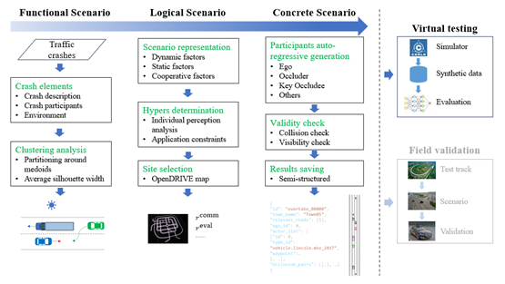

# <i>CoRTSG: A general and effective framework of risky testing scenario generation for cooperative perception</i>
<strong>CoRTSG</strong> is a general and effective framework generating **risky testing scenarios** for **cooperative perception**. It's the ever-known first driving safety-oriented for cooperative perception in V2X environmnet. All things are done by data and priors and no training is required. The resulting risky concrete scenarios can be implemented in virtual or real enviroment for further testing or validation.



The preprint paper is published [here]().

The generated and rendered concrete scenarios can be downloaded in [OpenDataLab](https://opendatalab.com/Rongsong/CoRTSG).

# Summary

Utilizing traffic crashes in which vision of driver of subejct/ego vehicle is obstructed, **11** risky functional scenarios are constructed. For each functional scenario, a logical scenario is determined. With the help of car-follwoing spacings, individual perception performance analysis, **17490** risky concrete scenarios are generated.

These risky concrete scenarios had been rendered using [CARLA](https://carla.org/) simulator. One can download them in [OpenDataLab](https://opendatalab.com/Rongsong/CoRTSG) for testing specific cooperative perception algorithms.

**Stats of Generated Risky Scenarios**
| Functional scenario | V2X | Map | Triples of (ego, occluders, key occludee) | No. of concrete scenarios |
| ---------       | ----  | ----   | ---   | ---  |
| S1: juncrush    | V2V&I | Town05 | 3762  | 1386 |
| S2: segrush     | V2V   | Town03 | 1428  | 729  |
| S3: segrush_v2  | V2V   | Town03 | 3057  | 1387 |
| S4: ruralcurve  | V2V   | Town07 | 3657  | 1667 |
| S5: juncreverse | V2V&I | Town05 | 15246 | 1361 |
| S6: juncturn    | V2V&I | Town05 | 64008 | 4396 |
| S7: juncsame    | V2V&I | Town05 | 75600 | 1132 |
| S8: parkingexit | V2V   | Town07 | 2040  | 712  |
| S9: overtake    | V2V   | Town01 | 73080 | 656  |
| S10: lanechange | V2V   | Town10HD | 37980 | 1392 |
| S11: onramp     | V2V   | Town06  | 5012 | 2672 |
| Overall         |       |        | 285044 | 17490 |

# Usage

## Installation

Clone this repo into your local machine and install it:
```
cd scripts/
git clone git@github.com:RadetzkyLi/CoRTSG.git

cd CoRTSG
pip install -r requirements.txt
python setup.py develop   # or pip install -e .
```

If you want to render the concrete scenarios to obtain images and point clouds, [CARLA==0.9.12](https://carla.org/) is needed.

If you want to collect training data, [SUMO>=1.18.0](https://sumo.dlr.de/docs/index.html) is needed.

## Running

### Data collection

This repo supports collecting training data in [OPV2V](https://mobility-lab.seas.ucla.edu/opv2v/) format for cooperative perception in V2X environment. Learn more about data collection [here](./coriskyscene/data_collection/README.md).

Upon this repo, [Multi-V2X](https://github.com/RadetzkyLi/Multi-V2X), a  multi-modal, multi-penetration-rate dataset for cooperative perception has been collected. 

### Risky scenario generation

**First**: Select locations in OpenDRIVE maps and specify hyper-parameters so as to obtain a logical scenario from a functional scenario.

**Second**: subclass ``BaseSceneGenerator`` or ``BaseSceneSequentialGenerator`` to create a generator that is responsible for generating concrete scenarios. 

Generators of 11 logical scenario (one for each functional scenario) had been completed and one can just run the following to repeat (if you want) the overtake scenario:
```
cd CoRiskyScene/coriskyscene/scene_generation/generator

python segment_overtake_scene_generator.py
```
By default, the results would be saved in a ``.json`` file in ``CoRiskyScene/coriskyscene/scene_generation/data/``.

Note: the time axis is not considered and thus a concrete scenario is a scene in the context.

### Risky scenario visualization

Before rendering, by viewing the scenario from top to down in a 2D image, one can check manually whether the generated scenarios are resonable and natural. Refer to this [tutorial](./examples/tutorials/visualize_scene.ipynb).

### Risky scenario rendering

After obtaining risky scenarios (stored in ``.json`` file), render them to get images and point clouds from various agents.
Modify the following variables in ``coriskyscene/scene_rendering/data_protocal.yaml``:
- ``output_dir``: change it to your preferred one.
- ``map_name``: change it to be consistent with risky traffic scenarios.

Then, run:
```
# use GPU 0
export CUDA_VISIBLE_DEVICES=2
export SDL_HINT_CUDA_DEVICE=2

export CARLA_HOME="Your CARLA installation directory"

cd CoRiskyScene/coriskyscene/scene_rendering
python render_scene.py --carla-cfg-file data_protocal.yaml --scene-path ${YOUR_SCENE_PATH}
```
By default, ``${YOUR_SCENE_PATH}`` lies in ``CoRiskyScene/coriskyscene/scene_generation/data/``. One can have a try using ``example.json`` in this directory. 

### Risky scenario-based testing

Based on [OpenCOOD](https://github.com/DerrickXuNu/OpenCOOD), to let it suitable for our testing purposes, the authors made some improvements:
- compatible for various datasets. Now, [OPV2V](https://mobility-lab.seas.ucla.edu/opv2v/), [V2XSet](https://github.com/DerrickXuNu/v2x-vit), [V2V4Real](https://github.com/ucla-mobility/V2V4Real), [Multi-V2X](https://github.com/RadetzkyLi/Multi-V2X) and our [CoRTSG](https://github.com/RadetzkyLi/CoRTSG) are supported.
- more metrics: accuracy, bandwith and safety gain are supported.

The code has been integreted in https://github.com/RadetzkyLi/OpenCOOD. 

# Contact
If you have any questions, feel free to open an issue.

# Citations
If you find our work useful in your research, feel free to give us a cite:
```BibTex
@article{rongsong2024cortsg,
      title={CoRTSG: A general and effective framework of risky testing scenario generation for cooperative perception}, 
      author={Rongsong Li and Xin Pei and Lu Xing},
      year={2024}
}
```